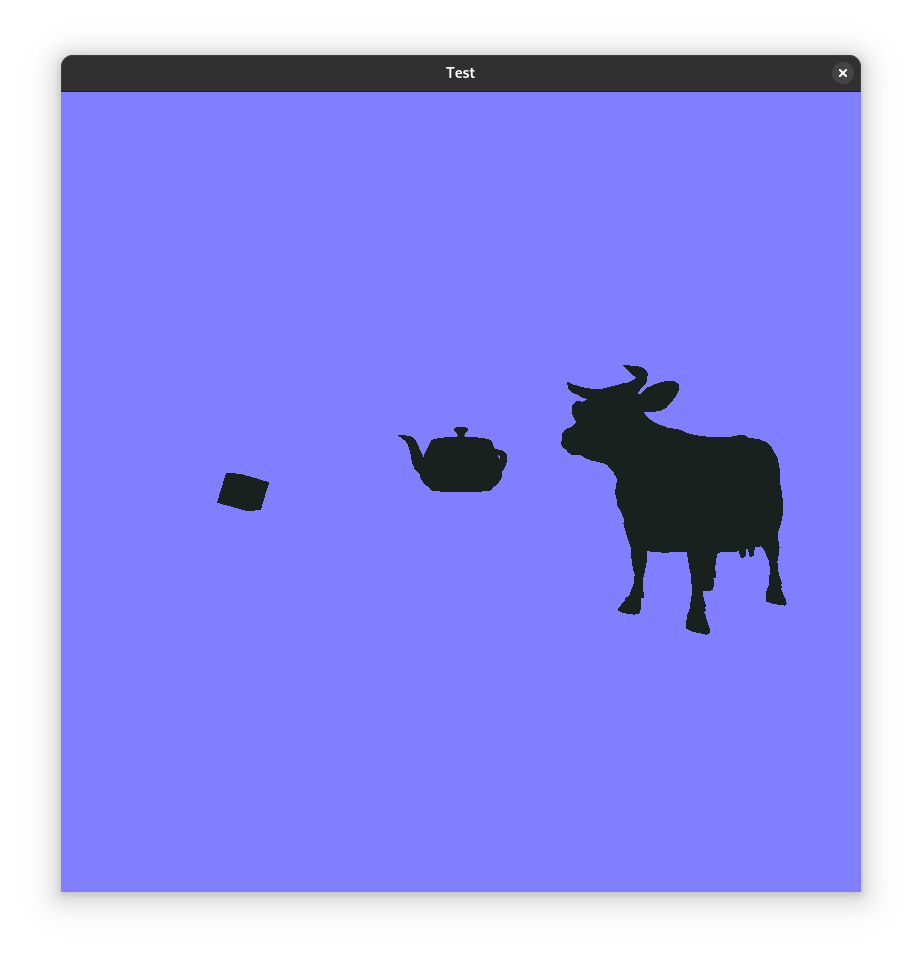
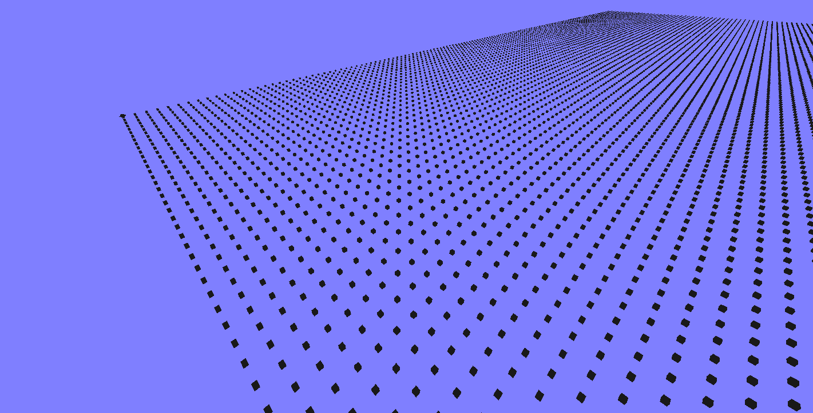

# Pic-g 3D Engine (Legacy OpenGL engine)
An simple 3D engine using OpenGL 1.1 and OS-native window management libraries.
Dependencies: X11, GLU, OpenGL. Currently only supports linux running X11.

### Some graphics demos I made with this:

## Collaboration
Please read the syntax.md document for information on code syntax and collaboration rules.