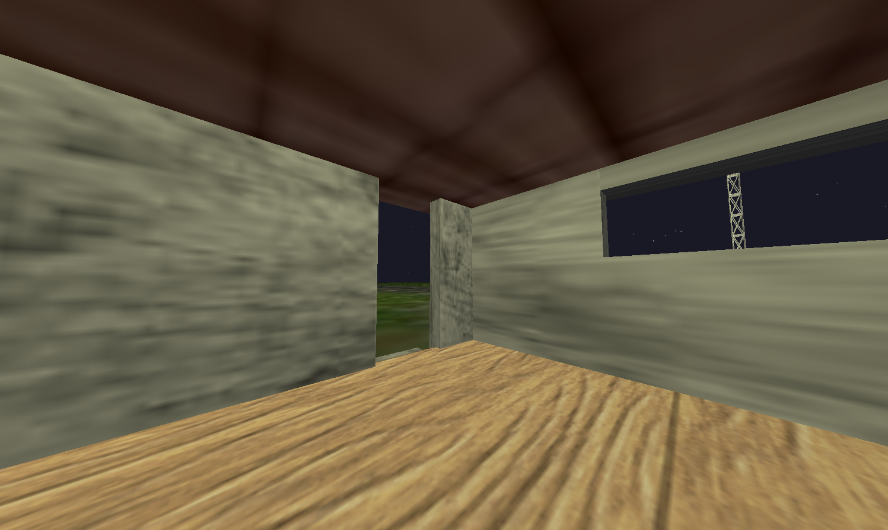
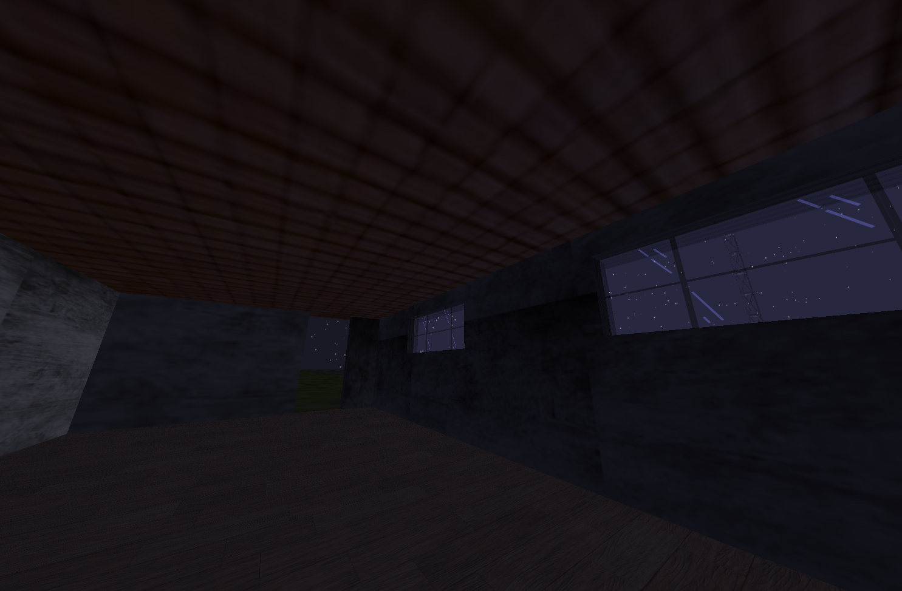
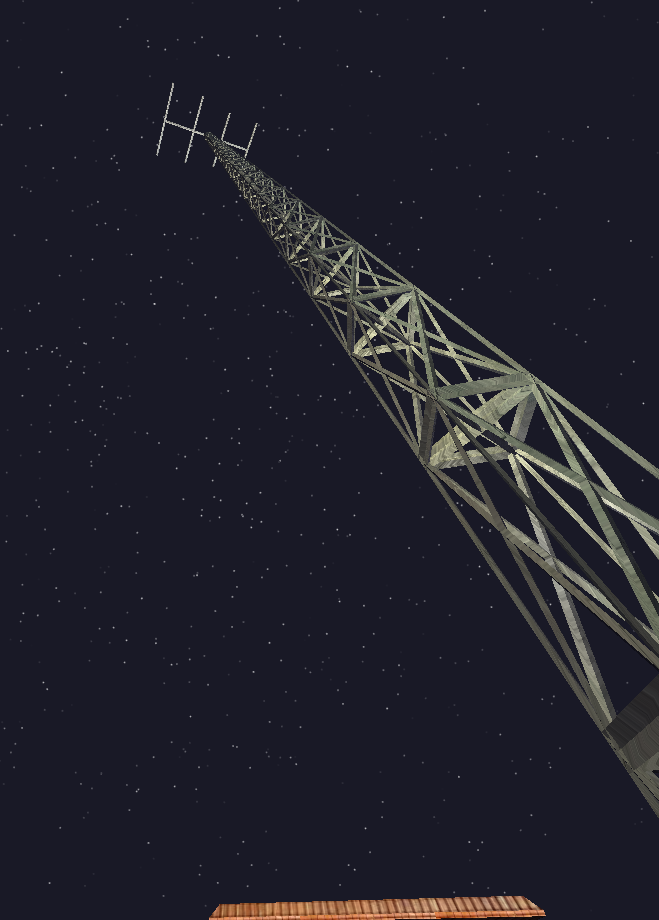
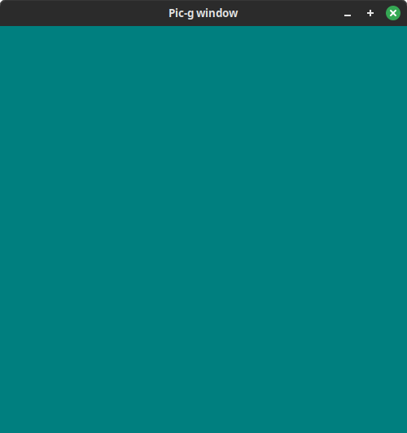
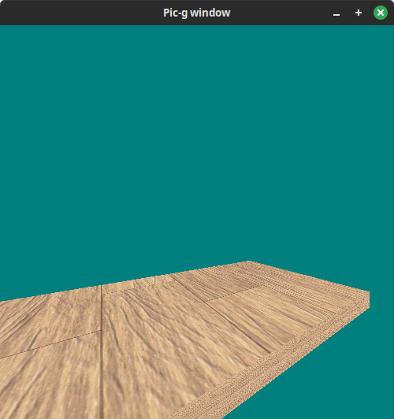
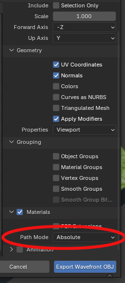

# Pic-g 3D Engine (Legacy OpenGL engine-framework)
An simple 3D engine-framework using OpenGL 1.1 and OS-native window management libraries.

### Some graphics demos I made with this:

<p float="left">





### Main features
- Wavefront OBJ loading
- Texturing (transparent textures are also supported!)
- Lighting
- Camera control
- Keyboard and mouse inputs
- Automatic bounding box calculation
- AABB-AABB collisions (dynamic and static)

# Installation (Linux)
1. Download the git repository and cd to it
```shell
git clone  https://github.com/Tammerodev/Pic-gEngine.git 
cd Pic-gEngine
 ```
2. Create and open build directory (executable will be found here)
```shell
mkir build && 
cd build
 ```

3. Run CMake
```shell
cmake ..
 ```

### Building the project
1. Make sure you created the program source file according to section "Scripting".

2. Build
```shell
cmake --build . 
 ```
3. Run the executable
```shell
./Pic-g 
 ```


# Windows cross-compiling
There is a script located at windows_compile/compile.sh, that compiles this using mingw32. 

# Scripting
Follow the instructions in the user-template/user-readme.md file.

### Creating the window 
At the start of your code, *program_init()*, you need to create the window where all of the graphics will be rendered. You also need to initialize the graphics interface, more on that later.

The window can be created with the function *picg_window_create* whose arguments are (*width, height, title, go fullscreen?*). After the window creation, initalize the graphics interface and optionally set window base color.

```c
picg_window_create(500, 500, "Pic-g window", false); // 500x500 window
picg_gl_init3D(500, 500);
picg_gl_setClearColor(.0f, .5f, .5f, 1.f);  // Window is cleared turuqoise
```

Now, the window will still be black. You need to clear and also display the window. 

```c
picg_gl_clear(); // program_update()
```
```c
picg_window_display(); // program_render()
```
 

This should be what you see when you build and run the project.

### Displaying a 3D model
For this, you need a .obj model. I chose a random model of a wooden floor I had. For 3D model functionality, you need to include the "<graphics/model/objects.h>" header from Pic-g.

In your program.c or whatever you named it, create a global variable to store the model.
```c
picg_model* model = NULL;
```

In your initialization code, program_init(), load the model like this. 
```c
/*  To use a relative path like here, import the CWD with the statement
    #include <globals/cwd.h> at the top  */
model = picg_modelObj_create(PICG_SOURCE_DIR"/<Path to your model>.obj");
model->mesh->position.z -= 20.f;
model->mesh->position.y -= 10.f;
model->mesh->rotation.y += 30.f;
```
This code also moves the object into a viewable position, as we havent set up the camera yet.

It is important to always perform null-checks when accessing the model raw (for example setting its position via *model->mesh->position*).

Render the model with the *picg_model_render* function, which takes in the pointer to our model. Call it every frame in program_render, before you call *picg_window_display*.

 

This is the result. We havent set up our lighting or proper camera yet. 


### Lighting


Lighting with vertex normals displayed (loaded from wavefront OBJ file


### Models
Format: wavefront .obj.

If using blender, please make sure export MTL texture path setting is to "absolute". 



### Textures
Texture image file format: .jpg, .png, .bmp, .hdr and .tga

Note: Textures MUST be the same width and height (aka square) and the sides must be powers of 2 (for example 16x16, 32x32... 2048x2048...);

#### Transparent and translucent textures
Transparent textures are fully supported. (Note that only .png, .bmp fully support transparency). 

Example/pseudocode for a transparent/translucent render:
```c
    // 1. Render your opaque (non-transparent) objects

    // 2. Render transparent objects
    picg_gl_beginTransparentRender();
        picg_model_render(your_transparent_model); 
    picg_gl_endTransparentRender();

    // 3. Display
```

## Collaboration
Please read the syntax.md document for information on code syntax and collaboration rules.

## Dependencies
Dependencies: 
- X11 (Linux), Windows API (Windows)
- Opengl 1.1 
- GLU
- stb_image,
- stb_truetype. 

Currently only supports linux running X11. Windows compilation is possible, but not implemented.
