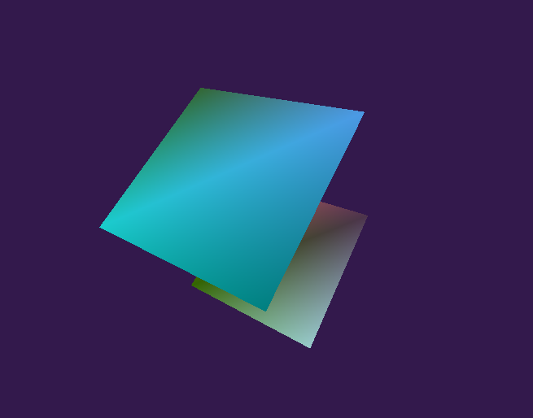

# Pic-g 3D Engine
An simple 3D using OpenGL 1.1 and OS-native window management libraries.

## Collaboration
Please read the syntax.md document for information on code syntax and collaboration rules.