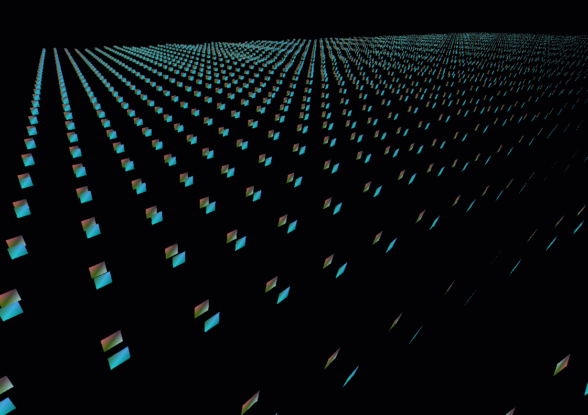
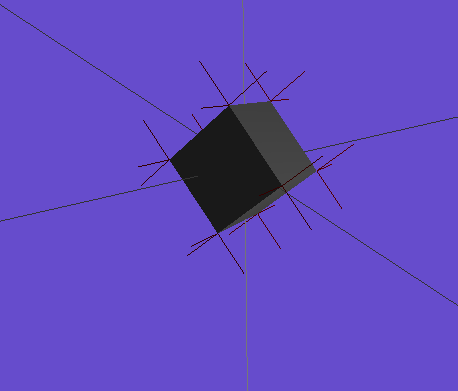

# Pic-g 3D Engine (Legacy OpenGL engine)
An simple 3D engine using OpenGL 1.1 and OS-native window management libraries.
Dependencies: X11, GLU, OpenGL. Currently only supports linux running X11. Windows compilation is possible, but all X11 things are not yet implemented. 

### Some graphics demos I made with this:

### Lighting

Lighting with vertex normals displayed (loaded from wavefront OBJ file)

## Windows cross-compiling
There is a script located at windows_compile/compile.sh, that compiles this using mingw32. 

## Collaboration
Please read the syntax.md document for information on code syntax and collaboration rules.