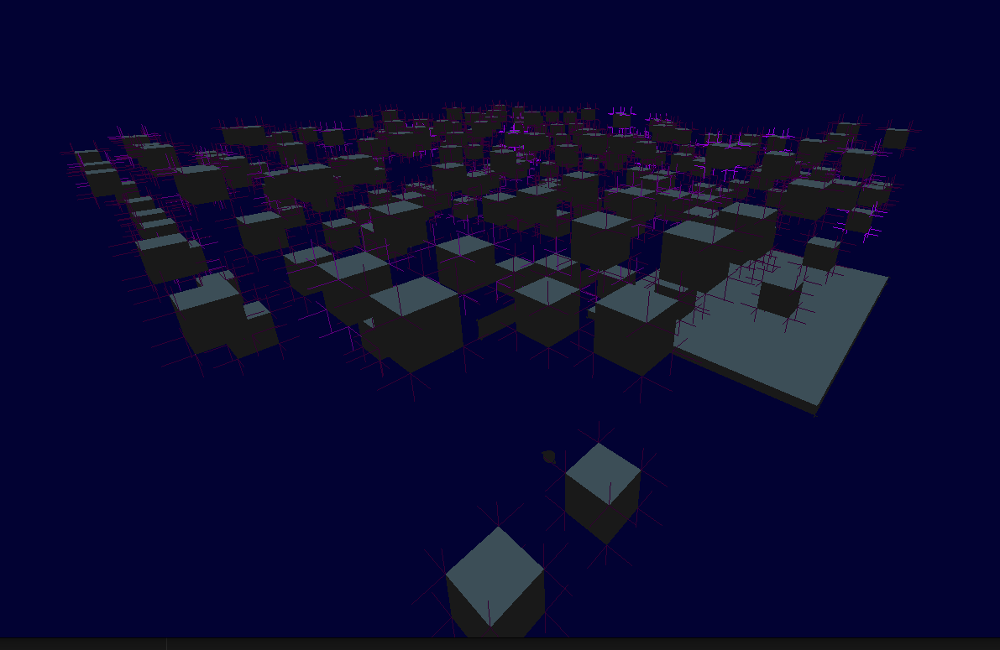

# Pic-g 3D Engine (Legacy OpenGL engine-framework)
An simple 3D engine-framework using OpenGL 1.1 and OS-native window management libraries.

### Some graphics demos I made with this:

<p float="left">


### Main features
- Wavefront OBJ loading
- Texturing
- Lighting
- Camera control
- Keyboard and mouse inputs
- Automatic bounding box calculation
- AABB-AABB collisions (dynamic and static)

# Installation (Linux)
1. Download the git repository and cd to it
```shell
git clone  https://github.com/Tammerodev/Pic-gEngine.git 
cd Pic-gEngine
 ```
2. Create and open build directory (executable will be found here)
```shell
mkir build && 
cd build
 ```

3. Run CMake
```shell
cmake ..
 ```

### Building the project
1. Make sure you created the program source file according to section "Scripting".

2. Build
```shell
cmake --build . 
 ```
3. Run the executable
```shell
./Pic-g 
 ```


# Windows cross-compiling
There is a script located at windows_compile/compile.sh, that compiles this using mingw32. 

# Scripting
Rename the "program.c-info" file into "program.c". Your code will be written here.

### Lighting



Lighting with vertex normals displayed (loaded from wavefront OBJ file


### Models
Format: wavefront .obj.

If using blender, please make sure export MTL texture path setting is to "absolute". 


### Textures
Format: .jpg

Note: Textures MUST be the same width and height (aka square) and the sides must be powers of 2 (for example 16x16, 32x32... 2048x2048...);

## Collaboration
Please read the syntax.md document for information on code syntax and collaboration rules.

## Dependencies
Dependencies: 
- X11 (Linux), Windows API (Windows)
- Opengl 1.1 
- GLU
- stb_image,
- stb_truetype. 

Currently only supports linux running X11. Windows compilation is possible, but not implemented.
